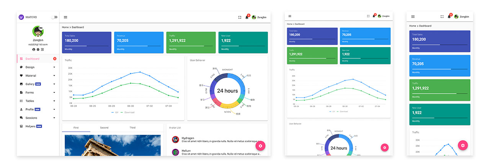

# 开始使用

Ng-Matero 是基于 Angular Material 组件库开发的项目，所以你需要了解 TypeScript 及 Sass 的基础知识。

## 安装

使用 CLI 初始化项目是最便捷的方式，通过初始化选项可以定制主题样式等。详情查看 [添加项目](schematics/project-init.md)

```bash
$ ng new <project-name>
$ cd <project-name>
$ ng add ng-matero
```

除了 CLI 安装方式之外，也可以克隆 Starter 仓库，不过 Starter 只有侧边栏一种布局样式。

```bash
$ git clone --depth=1 git@github.com:ng-matero/starter.git <project-name>
$ cd <project-name>
$ npm install
```

## 本地开发

建议使用 hmr 运行程序，不要使用 `npm start` 或者 `ng serve`

```bash
$ npm run hmr
```

克隆完整仓库

```bash
$ git clone git@github.com:ng-matero/ng-matero.git
$ cd ng-matero
$ npm install
$ npm run hmr
```

打开浏览器访问 `http://localhost:4200/`



## 项目目录

```text
├── src
│   ├── app
│   │   ├── core                               
│   │   │   ├── bootstrap                       # 初始化相关服务
│   │   │   │   ├── menu.service.ts             # 菜单配置
│   │   │   │   ├── settings.service.ts         # 页面布局配置
│   │   │   │   └── startup.service.ts          # 初始化项目配置
│   │   │   ├── interceptors                    # HTTP 拦截器
│   │   │   │   └── default.interceptor.ts
│   │   │   │── core.module.ts                  # 核心模块
│   │   │   │── **
│   │   │   └── settings.ts                     # 布局配置选项
│   │   ├── routes                              
│   │   │   ├── **
│   │   │   ├── routes-routing.module.ts        # 业务路由注册口
│   │   │   └── routes.module.ts                # 业务路由模块
│   │   ├── shared                              
│   │   │   |—— **
│   │   │   └── shared.module.ts                # 共享模块
│   │   ├── theme                               
│   │   │   ├── admin-layout                    # Admin 布局
│   │   │   ├── auth-layout                     # 登陆注册布局
│   │   │   ├── style                           # 核心主题样式
│   │   │   ├── style.scss
│   │   |   └── theme.module.ts                 # 主题模块
│   │   ├── app.component.ts                    # 根组件
│   │   ├── app.module.ts                       # 根模块
│   │   └── material.module.ts                  # Material 组件模块
│   ├── assets                                  # 本地静态资源
│   ├── environments                            # 环境变量配置
│   ├── styles                                  # 业务相关样式目录
│   │   ├── grid                                # 响应式布局类
│   │   ├── helpers                             # 工具类
│   │   ├── plugins                             # 第三方库样式
│   │   ├── **
│   │   ├── _app-theme.scss
│   │   └── themes.scss                        # 主题样式配置文件
└── └── styles.scss                             # 样式主入口文件
```

目录结构遵循 Angular 风格指南，同时也是为了方便 CLI 添加业务模块，后期可能还有微调。


## 项目运行

项目运行后默认执行 `startup.service`，项目启动前的一些关键信息，比如菜单、用户信息等，都可以写在 `startup.service` 中。

